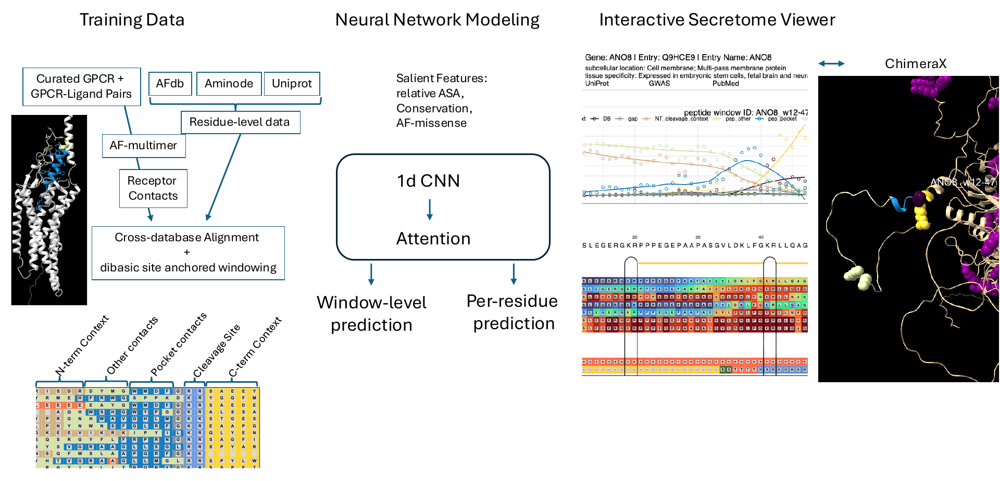

<h1 align="center">ligandFinder</h1>

<p align="center">
  <b>Genome-scale discovery of secreted peptide ligands for orphan GPCRs.</b><br>
  <sub>Scores every candidate cleavage window in the human secretome, residue by residue.</sub>
</p>

<p align="center">
  <a href="https://d2v3leolhhovg9.cloudfront.net/ligandFinder_v3.html"><b>Browse the secretome viewer →</b></a>
</p>

<!-- Pipeline overview. Regenerate or replace at man/figures/pipeline.png -->
<p align="center">
  
</p>

---

## The problem

Most secreted peptide hormones are cut out of larger precursor proteins at
**dibasic sites** (…K‑R…, …R‑R…). The precursor sequence alone does not tell you
which of those sites are real: a typical secreted protein has dozens of dibasic
pairs and at most a couple are genuine processing sites.

ligandFinder scores every candidate site in context — structure, conservation,
solvent accessibility and predicted receptor contacts — and ranks the windows
that look like real peptide termini.

## How it works

### 1 · Training data

Known GPCR–ligand pairs are modelled with AlphaFold-Multimer to get **receptor
contact residues**, then aligned across UniProt, the AlphaFold database and
Aminode. Every candidate site becomes a **36-residue window** anchored on the
dibasic pair, and each residue in that window carries a class label:

| class | meaning |
|---|---|
| `NT_cleavage_context` | residues leading into the N-terminal cut |
| `CT_cleavage_context` | residues leading into the C-terminal cut |
| `DB` | the dibasic pair itself |
| `pep_pocket` | peptide residues contacting the receptor pocket |
| `pep_other` | other peptide residues |
| `gap` | non-peptide spacer |
| `none` | background |
| `padding` | window overhangs the sequence |

Each window carries 26 input channels per residue — relative solvent
accessibility, conservation, AlphaFold-missense, secondary structure, backbone
angles, H-bond energies and amino-acid properties.

### 2 · Model

A small 1-D CNN with an attention head, trained **once per terminus** (N and C):

```
input 36 × 26  (+ normalised position ramp)
  → Conv1D 16 · gelu → Conv1D 8 · gelu          shared trunk
  → per-residue logits (8 classes)
       ├── softmax                              per-residue head
       └── masked softmax → attention → pool
             → embed 16-d → global window score
```

Deliberately tiny — **2,438 parameters** — because the labelled set is small: a
few dozen known peptides per terminus. Training oversamples the positives,
jitters the continuous channels as augmentation, and calibrates the two models
onto a common scale with a single pooled Platt fit.

The modelling lives in [`inst/python/lf_dcnn`](inst/python/lf_dcnn) (Keras 3).
It runs in-process from R through reticulate, or standalone from `.npz` files
with no R at all.

### 3 · Outputs

Every window gets a calibrated score, a per-residue class profile, and a 16-d
embedding used to retrieve its nearest known peptide.

Results are published as **interactive per-gene pages**: hover any window for its
score and per-residue profile, jump into the sequence alignment, or open the
structure in ChimeraX.

> **[Browse the secretome viewer →](https://d2v3leolhhovg9.cloudfront.net/ligandFinder_v3.html)**
>
> Every scored window in one map, linked through to its per-gene page.

## Installation

```r
if (!requireNamespace("BiocManager", quietly = TRUE)) install.packages("BiocManager")
BiocManager::install("Biostrings")

if (!requireNamespace("arrow", quietly = TRUE)) install.packages("arrow")
install.packages(c("bio3d", "httr"), dependencies = TRUE)

if (!requireNamespace("remotes", quietly = TRUE)) install.packages("remotes")
remotes::install_github("kbrulois/ligandFinder")
```

The neural network needs Python with TensorFlow and Keras 3 — the same
virtualenv `keras3` already uses:

```r
reticulate::virtualenv_create("r-tensorflow")
reticulate::virtualenv_install("r-tensorflow", c("tensorflow", "keras", "pandas", "pyarrow", "scipy"))
```

## Quick start

Score every window and attach the results, from R:

```r
source("R/dcnn_bridge.R")

dcnn <- lf_dcnn_run(nn_input, all_params3, seed = 42L)

nn_input_comb$pred      <- dcnn$pred        # calibrated score
nn_input_comb$pred_raw  <- dcnn$pred_raw    # uncalibrated
nn_input_comb$per_index <- dcnn$per_index_tbl
```

Or run the model standalone, without R:

```bash
python -m lf_dcnn train --input-dir arrays/ --output-dir results/
```

## Repository layout

| path | what |
|---|---|
| `R/` | package functions — AlphaFold access, metric processing, plotting, the Python bridge |
| `inst/python/lf_dcnn/` | the 1-D CNN: config, model, losses, sampler, calibration |
| `inst/scripts/putative_peptide/` | the pipeline, in run order |
| `inst/scripts/10_1dcnn_new6.R` | window scoring + downstream analysis |
| `inst/scripts/10_3_peptide_umap.R` | the UMAP figure pipeline |
| `terraform/` | S3 + CloudFront hosting for the generated pages |

## Tests

```bash
cd inst/python && PYTHONPATH=. python -m lf_dcnn selftest   # 12 checks
Rscript inst/python/tests/roundtrip.R                       # 33 checks, R ↔ Python
```
